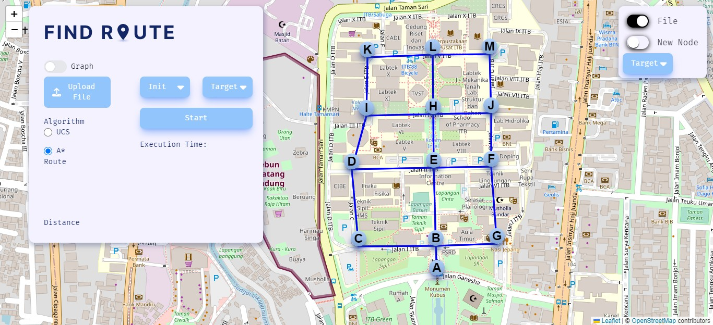
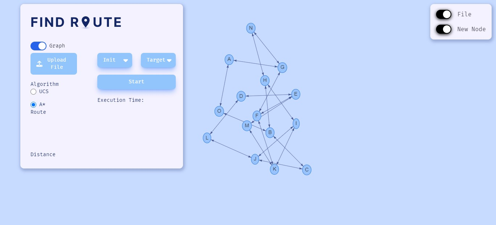

# Shortest Path Finding with UCS and A*

# Description


In this web app, you can find the shortest path rute with UCS and A* algorithm. This app also provides two modes to show the graph, the graph mode and the map mode. Make sure you have the correct file format, so it does not raise any toast floating around!!! Here is the correct file format
```
16 -> how many nodes there are 
A (-6.921141,107.607668) -> nodes name (x, y)
B (-6.920768,107.604056)
C (-6.918263,107.604216)
D (-6.919038,107.606670)
E (-6.920995,107.606441)
F (-6.922551,107.607619)
G (-6.922771,107.609810)
H (-6.925376,107.610599)
I (-6.926075,107.610524)
J (-6.925835,107.607071)
K (-6.924356,107.607253)
L (-6.924317,107.606160)
M (-6.923950,107.603842)
N (-6.922388,107.606404)
O (-6.923443,107.606298)
P (-6.923100,107.603892)
0 0 0 0 1 1 0 0 0 0 0 0 0 0 0 0 -> matrix adjacency between nodes
0 0 1 0 1 0 0 0 0 0 0 0 0 0 0 1
0 1 0 1 0 0 0 0 0 0 0 0 0 0 0 0
0 0 1 0 1 0 0 0 0 0 0 0 0 0 0 0
1 1 0 1 0 0 0 0 0 0 0 0 0 0 0 0
1 0 0 0 0 0 1 0 0 0 0 0 0 1 0 0
0 0 0 0 0 1 0 1 0 0 0 0 0 0 0 0
0 0 0 0 0 0 1 0 1 0 0 0 0 0 0 0
0 0 0 0 0 0 0 1 0 1 0 0 0 0 0 0
0 0 0 0 0 0 0 0 1 0 1 0 0 0 0 0
0 0 0 0 0 0 0 0 0 1 0 1 0 0 0 0
0 0 0 0 0 0 0 0 0 0 1 0 1 0 1 0
0 0 0 0 0 0 0 0 0 0 0 1 0 0 0 1
0 0 0 0 0 1 0 0 0 0 0 0 0 0 1 0
0 0 0 0 0 0 0 0 0 0 0 1 0 1 0 1
0 1 0 0 0 0 0 0 0 0 0 0 1 0 1 0
```

# How to Run
1. Clone this repository
2. Go to src folder `cd src`
3. Install all dependencies using  `npm install`
4. Run the web app using `npm run dev`
5. Use `localhost:3000` and open it in your browser app


# Author
| NIM  | Nama |
| ------------- | ------------- |
| 13521132  | Dhanika Novlisariyanti |
| 13521150 | I Putu Bakta Hari Sudewa |

